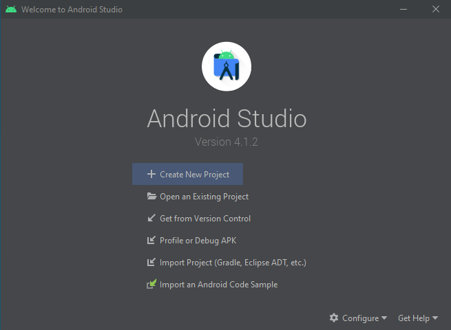
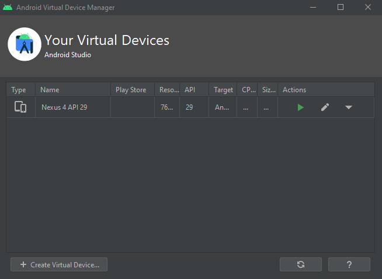

# Step-1: การติดตั้ง

## ติดตั้ง Nodejs

ดาวน์โหลดไฟล์จาก https://nodejs.org/en และทำการติดตั้ง หลังจากติดตั้งสำเร็จทดสอบการติดตั้งด้วยการเปิดโปรแกรม Command Prompt หรือ โปรแกรม Terminal และใช้คำสั่ง

```bash
$ node -v
$ npm -v
```

## ติดตั้ง Ionic cli

หลังจากติดตั้ง Nodejs ให้ใช้คำสั่งดังนี้เพื่อติดตั้ง Ionic cli

```bash
$ npm install -g @ionic/cli
```

ทดสอบการติดตั้งโดยการใช้คำสั่ง

```bash
$ ionic -v
```

## ติดตั้ง Git

ดาวน์โหลดไฟล์จาก https://git-scm.com/downloads และทำการติดตั้ง หลังจากติดตั้งสำเร็จทดสอบการติดตั้งโดยใช้คำสั่ง

```bash
$ git --version
```

## ติดตั้งโปรแกรม Visual Studio Code

คุณสามารถใช้ Editor ตัวอื่นๆ เพื่อใช้ในการเขียนโค้ดได้ แต่ทีมงานแนะนำโปรแกรม Visual Studio Code ในการเขียน Ionic ดาวน์โหลดไฟล์จาก https://code.visualstudio.com/ และทำการติดตั้ง เพื่อใช้ในการเขียนโปรแกรม

## สร้างโปรเจค helloworld

```bash
$ ionic start helloworld blank
$ cd helloworld
$ ionic serve
```

หากรันสำเร็จระบบจะทำการเปิดบราว์เซอร์และพาเราไปยังลิงค์ http://localhost:8100 (หากระบบไม่เปิดบราวเซอร์และพาไปยังลิ้งค์ดังกล่าวอัตโนมัติ ให้ทำการกรอกลิ้งค์ในบราว์เซอร์เอง) ซึ่งจะได้ผลลัพธ์ดังรูป


หากต้องการหยุดการทำงาน ให้ไปที่โปรแกรม Command Prompt หรือ Terminal ที่ทำการรัน Ionic อยู่ และกดคีย์ลัด Ctrl+c เพื่อทำการหยุดการทำงาน

## การพัฒนา Android

ในการพัฒนาแอปพลิเคชันในฝั่งของ Android จำเป็นต้องติดตั้ง Android Studio เพื่อใช้งาน Emulator สำหรับทดสอบรันแอปพลิเคชัน และ Build แอปพลิเคชันเป็น APK (ไฟล์ติดตั้งแอปพลิเคชันบนมือถือ Android) โดยมีวิธีการติดตั้งดังนี้

### 1. ติดตั้ง Java Development Kit (JDK)

คู่มือของ Ionic แนะนำให้ติดตั้ง [JDK8](https://ionicframework.com/docs/developing/android#java) สามารถเข้าไปด้วยโหลดได้ที่ https://www.oracle.com/java/technologies/javase/javase-jdk8-downloads.html หรือ https://openjdk.java.net/

*ในกรณีที่ของ `Windows` ทีมงานแนะนำวิธีติดตั้งที่สะดวกรวดเร็วโดยไม่ต้องสมัครบัญชี Oracle และตั้งค่า Path “JAVA_HOME” คือ ติดตั้งผ่าน [Chocolatey](https://chocolatey.org/) โดยวิธีติดตั้งนี้ คุณจะต้องติดตั้งซอฟต์แวร์ดังกล่าวก่อน จากนั้นเปิด Command Prompt ของ Administrator (คลิกขวาที่ Command Prompt และเลือก "Run as Administrator") และรันคำสั่ง

```bash
choco install -y openjdk8
```

ทดสอบการติดตั้งโดยการใช้คำสั่ง

```bash
$ java -version
```

### 2. ติดตั้ง Android Studio

ดาวน์โหลดไฟล์จาก https://developer.android.com/studio และทำการติดตั้ง

### 3. ติดตั้ง Android SDK

หลังจากติดตั้ง Android Studio สำเร็จ ให้เปิดโปรแกรม Android Studio จะปรากฏหน้าจอดังรูปนี้



กดปุ่ม Configure ซึ่งอยู่บริเวณด้านล่าง และเลือก SDK Manager จะพบกับหน้าต่างดังรูปนี้


ให้เลือกเป็น Android 10.0 (Q)  (หรือเวอร์ชันตามความเหมาะสม) และกดปุ่ม Apply จากนั้นรอดำเนินการติดตั้งจนเสร็จ

### 4. ตั้งค่า Emulator

หลังจากดำเนินการในขั้นตอนที่ 3 เสร็จแล้ว จะยังเห็นหน้าต่าง Welcome ใน Android Studio ให้ทำการกดปุ่ม Configure และเลือก AVD Manager จะพบกับหน้าต่างดังรูปนี้



ให้ทำการกดปุ่ม + Create Virtual Device... และเลือก Category เป็น Phone เลือก Nexus 4 (หรือรุ่นอื่นๆ ตามความเหมาะสม) จากนั้นกดปุ่ม Next
ในส่วนของ System Image คือเลือกว่า Emulator ที่สร้างจะเป็น Android เวอร์ชันใด ให้เลือกเวอร์ชัน Q (หรือเวอร์ชันตามความเหมาะสม) จากนั้นกดปุ่ม Next และกดปุ่ม Finish

### 5. เซต Environment Variables 

5.1 `เปิด File Explorer` และ`คลิกขวาที่ Icon This PC (หรือ Computer)` จากนั้นคลิก `Properties` -> `Advanced System Settings` -> `Environmental Variables`

5.2 `กดปุ่ม New…` เพื่อสร้าง system variable ใหม่ โดยตั้งชื่อ `ANDROID_HOME` และเก็บค่าที่อยู่ Android SDK ของคุณดังรูป


ตำแหน่งเริ่มต้นสำหรับโฟลเดอร์ SDK คือ:

```
%LOCALAPPDATA%\Android\Sdk
```

5.3 `คลิกที่ Path` อยู่ใต้ System variables และ`กดปุ่ม Edit…`

5.4 `กดที่ปุ่ม New` เพิ่ม path "platform-tools"

ตำแหน่งเริ่มต้นสำหรับโฟลเดอร์นี้คือ:

```
%LOCALAPPDATA%\Android\Sdk\platform-tools
```

5.5 `กดที่ปุ่ม New` เพิ่ม path "tools/bin"

ตำแหน่งเริ่มต้นสำหรับโฟลเดอร์นี้คือ:

```
%LOCALAPPDATA%\Android\Sdk\tools\bin
```

5.6 `กดที่ปุ่ม New` เพิ่ม path "emulator"

ตำแหน่งเริ่มต้นสำหรับโฟลเดอร์นี้คือ:

```
%LOCALAPPDATA%\Android\Sdk\emulator
```

<br />
<br />

สามารถดูคู้มือ Ionic ในส่วนนี้ได้ที่ https://ionicframework.com/docs/developing/android

<!-- ## ทดสอบ Build APK

## 1. Generate native โปรเจค

```bash
$ ionic capacitor add android
```

## 2. เซ็ต Package ID.

เปิดไฟล์ `capacitor.config.json` และแก้ไขใน property `appId`

## 3. คัดลอกโฟล์เดอร์ `www` ไปยัง native โปรเจค

```bash
$ ionic capacitor copy android
```

## 4. เปิด Android Studio

```bash
$ npx capacitor open android
``` -->
